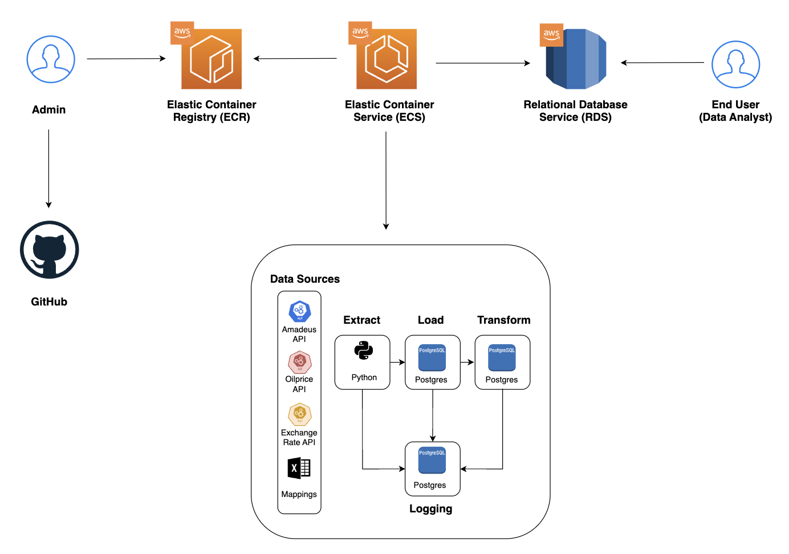

# Flight Fare Data Tracker

## Objective

This project is dedicated to developing a robust and comprehensive dataset, specifically engineered for use by data analysts and scientists in the travel industry. Our focus is on the intricacies of data engineering, demonstrating our expertise in gathering, processing, and structuring data to facilitate advanced airfare strategy development. This dataset will serve as a crucial asset for travel agencies, aiding in the optimization of ticket pricing and providing exceptional value to travelers.

## Consumers

Who will benefit most from this dataset, and what are their data interaction preferences?

- Data Analysts and Scientists in the Aviation and Travel Sector: These professionals require a reliable and rich source of data to extract meaningful insights regarding flight pricing trends and patterns.
- Tech-savvy Individuals Monitoring Airfare Trends: A segment of users who rely on data accuracy and comprehensiveness to track and predict airfare changes effectively.

## Questions

What questions are you trying to answer with your data? How will your data support your users?

- What are the best day of the week or months to fly on?
- What is the correlation between exchange rate and flight prices?
- What are the effects of oil prices on flight prices?
- What is the most expensive / cheapest price to Hong Kong if I were to spend 9 days?

## Source datasets

| Source name       | Source type | Source documentation                                  |
| ----------------- | ----------- | ----------------------------------------------------- |
| Amadeus API       | REST API    | https://developers.amadeus.com/self-service/apis-docs |
| Oilprice API      | REST API    | https://docs.oilpriceapi.com/                         |
| Exchange Rate API | REST API    | https://docs.abstractapi.com/exchange-rates           |

## Solution architecture

## Breakdown of tasks

How is your project broken down? Who is doing what?

- Justin:
  - setup for api call of flight data (1/15, done)
  - extract and load part of flight data (1/15, done)
  - docker setup (1/18, done)
  - transform (1/22, done)
- Tim:
  - setup for api call of exchange rate data (1/15, done)
  - logging (1/18, done)
  - unit tests (1/18, done)
  - transform (TODO: 1/22)
- Ahmed:
  - setup for api call of oil prices (1/15, done)
  - extract and load of oil price and/or exchange rate data (1/18, done)
  - transform (1/18, done)
  - AWS (1/22, done)

# Lessons Learnt

- Orchestrating whole project using OOP
- Working as a team in GitHub, with different tasks assigned to each
- Integrating code logic all together
- Technicalities with unit testing, pipeline logging, and ELT building
- Integrating Amadeus API full of bugs
